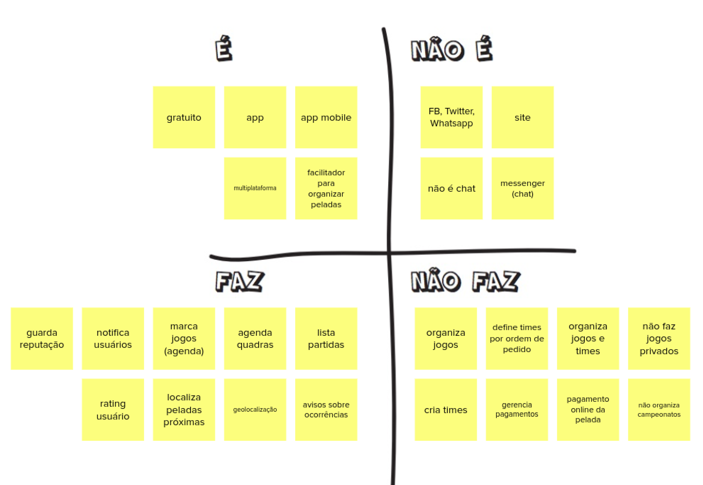
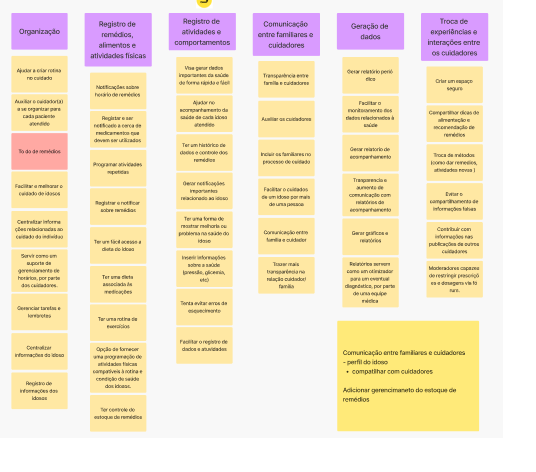

# Lean Inception -  Dia 1

## Histórico de versões
|    Data    | Versão |      Descrição       |                    Autor                     |
|:----------:|:------:|:--------------------:|:--------------------------------------------:|
| 19/04/2024 |  1.0   | Criação do documento | [Jessica Luiza](https://github.com/JKluiza) |

## Sobre 

O primeiro dia da Lean Inception é marcado por três atividades fundamentais que unem técnica e cliente numa visão unificada do produto a ser criado. Essas práticas são cruciais para assegurar uma interpretação consistente e um entendimento comum acerca do propósito central do produto e de suas funcionalidades chave. O alinhamento obtido é crucial para o time de desenvolvimento captar com totalidade o que o produto busca realizar, encaixando-se perfeitamente com as expectativas do cliente.

## Visão do Produto

Na fase inicial da Lean Inception denominada "Visão do Produto", busca-se estabelecer um entendimento comum e preciso acerca do produto em processo de criação. Durante esta fase, o coletivo envolvido no projeto — que engloba profissionais da área técnica, autoridades em negócios e vocais dos clientes ou usuários — se congrega para moldar uma imagem abrangente do produto em idealização.

Conceber essa visão consensual é crucial para que todos os membros da equipe estejam sintonizados em relação às metas centrais e à identidade do projeto. Isso estabelece um ponto de partida límpido e compartilhado que facilita o alinhamento de perspectivas e compreensões sobre a obra em andamento. Tal alinhamento é de importância capital em ambientes de desenvolvimento ágeis, nos quais se preza a flexibilidade e adaptação, permitindo que a visão estabelecida do produto atue como um referencial constante para assegurar a conformidade do resultado final aos anseios do negócio e expectativas dos stakeholders.

### Visão do Produto do GEROcuidado

## É/não é - Faz/não faz

A atividade de delimitação "É/Não É" e "Faz/Não Faz" consiste na criação de listas que definem claramente o que está incluso no produto e o que está fora do alcance, assim como as funcionalidades que o produto oferece e aquelas que não são oferecidas. As listas "É/Não É" e "Faz/Não Faz" são cruciais para estabelecer limites claros do projeto, o que auxilia na prevenção de confusões e de um escopo de projeto que vá além do previsto.

 #### - **"É/Não É"**
Esclarece o que o produto realmente compreende em termos de recursos, capacidades e atributos. Ela assegura que todos os membros da equipe e o cliente tenham um entendimento comum e conciso do que será entregue. Isso é importante para evitar a inclusão de recursos adicionais que não foram originalmente planejados.

### - **"Faz/Não Faz"** 
Detalha as funcionalidades e operações específicas que o produto é capaz de realizar, bem como toda e qualquer operação que ele não irá desempenhar. Isso ajuda a alinhar as expectativas do cliente quanto à performance e comportamento do produto final.

Efetivamente, essas listas contribuem para uma melhor comunicação entre a equipe de desenvolvimento e o cliente, garantem que o desenvolvimento seja focado apenas nos requisitos essenciais e previnem o surgimento de mal-entendidos quanto ao que o produto é capaz ou não é capaz de fazer.

## É/não é - Faz/não faz do GEROcuidado

## Objetivos do Produto 

Na etapa designada como "Objetivos do Produto", que ocorre durante o processo de Lean Inception, a meta é a definição precisa e quantificável dos fins aos quais o produto se destina. Este estágio é fundamental, pois norteia o desenvolvimento rumo ao cumprimento das expectativas dos clientes e às demandas do negócio.

Durante a definição dos objetivos, procede-se à categorização em "clusters", que servem para agrupar objetivos de natureza similar sob um mesmo rótulo geral, facilitando a organização e o entendimento das metas a serem atingidas pelo produto em desenvolvimento.

[def]: ...docs/assets/Gero_Visãodoproduto.png