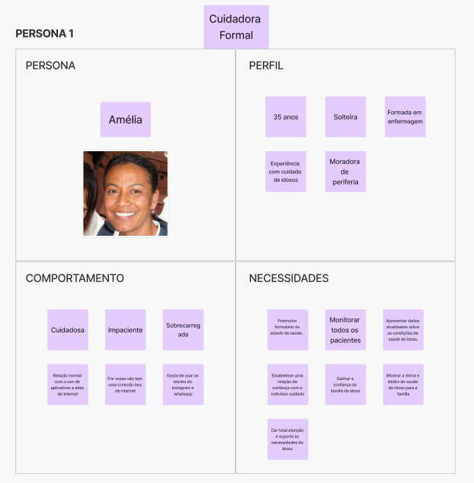
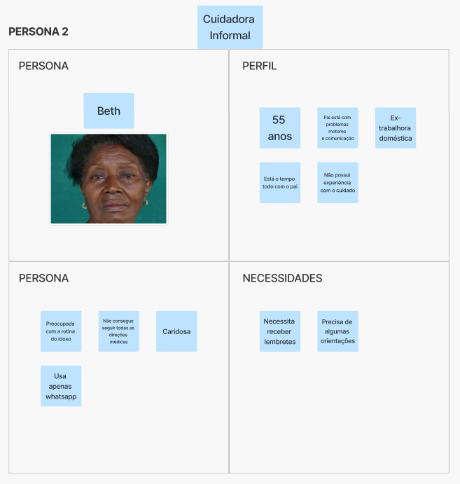
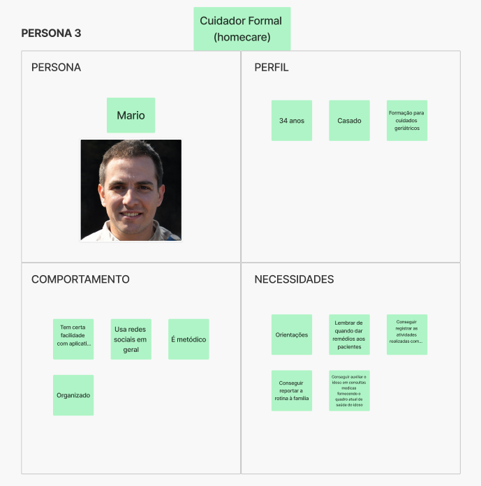
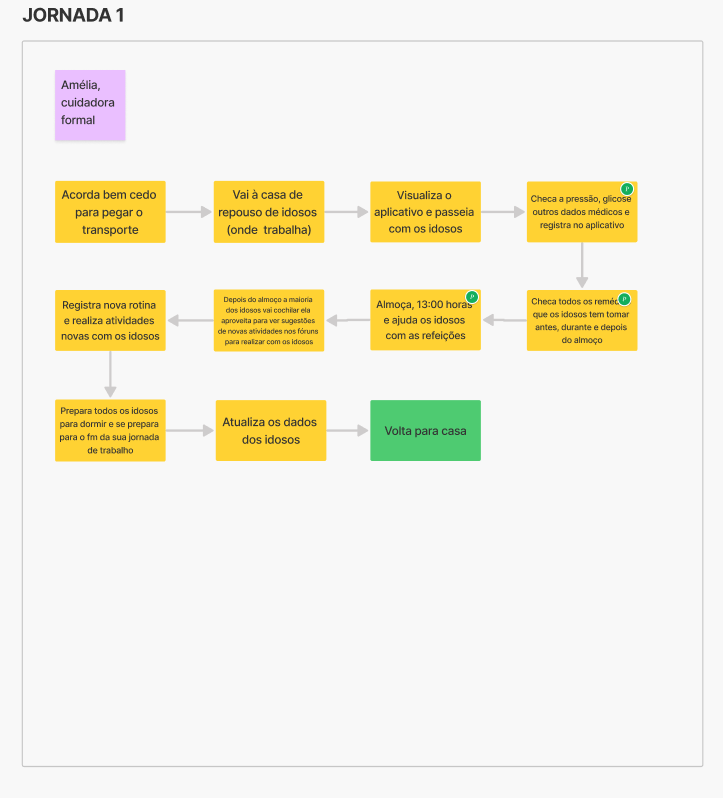
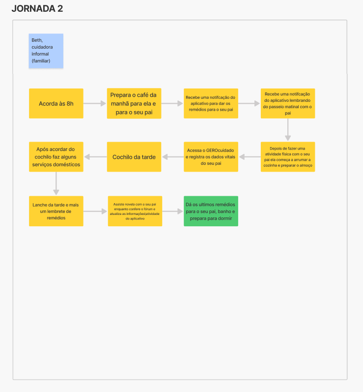
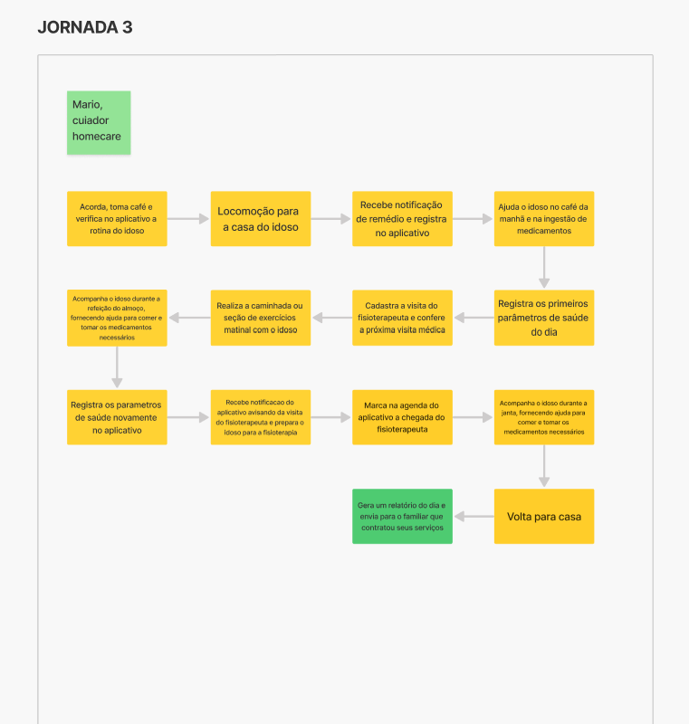

# Lean Inception -  Dia 2

## Histórico de versões
|    Data    | Versão |      Descrição       |                    Autor                     |
|:----------:|:------:|:--------------------:|:--------------------------------------------:|
| 13/04/2024 |  1.0   | Criação do documento | [Sebastian Zuzunaga](https://github.com/sebazac332) |

## Sobre
No segundo dia de Lean Inception veremos duas partes cruciais para o desenvolvimento do projeto, a "Descrição das Pessoas" e a "Jornada de Usuário". Definir estes dois itens nos ajudará a entender quem são os usuários do produto e como interagem com este em seu dia a dia.

## Descrição das Personas
Foram criadas descrições detalhadas das pessoas que utilizaram a nossa aplicação, cada uma delas representa um grupo de utilizadores com características específicas. Cada persona recebe um nome, uma foto e uma descrição que inclui informações como idade, gênero, necessidades, desafios, metas e comportamentos típicos. O objetivo é definir as caracteristicas dos diferentes grupos que utilizarão o produto para assim poder visualizar com clareza suas necessidades em relação à aplicação.

### Personas do GEROcuidado
#### Persona 1 - Cuidadora Formal

#### Persona 2 - Cuidadora Informal

#### Persona 3 - Cuidador Formal (homecare)

## Jornadas de Usuário
A viagem de usuário serve para visualizar como um usuário interage com a aplicação passo a passo, desde a primeira interação até a conclusão de suas tarefas, serve também para ver em que contexto se vai usar, onde e quando. Ajuda-nos a identificar as necessidades do utilizador e possíveis problemas durante a sua utilização. Ajuda a ter uma visão completa da experiência do usuário.

### Jornadas de Usuário do GEROcuidado
#### Jornada de Usuário 1

#### Jornada de Usuário 2

#### Jornada de Usuário 3

