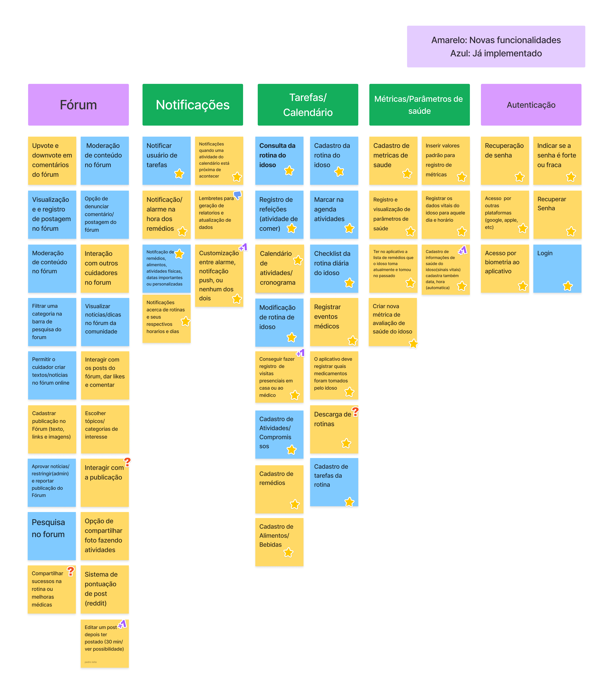
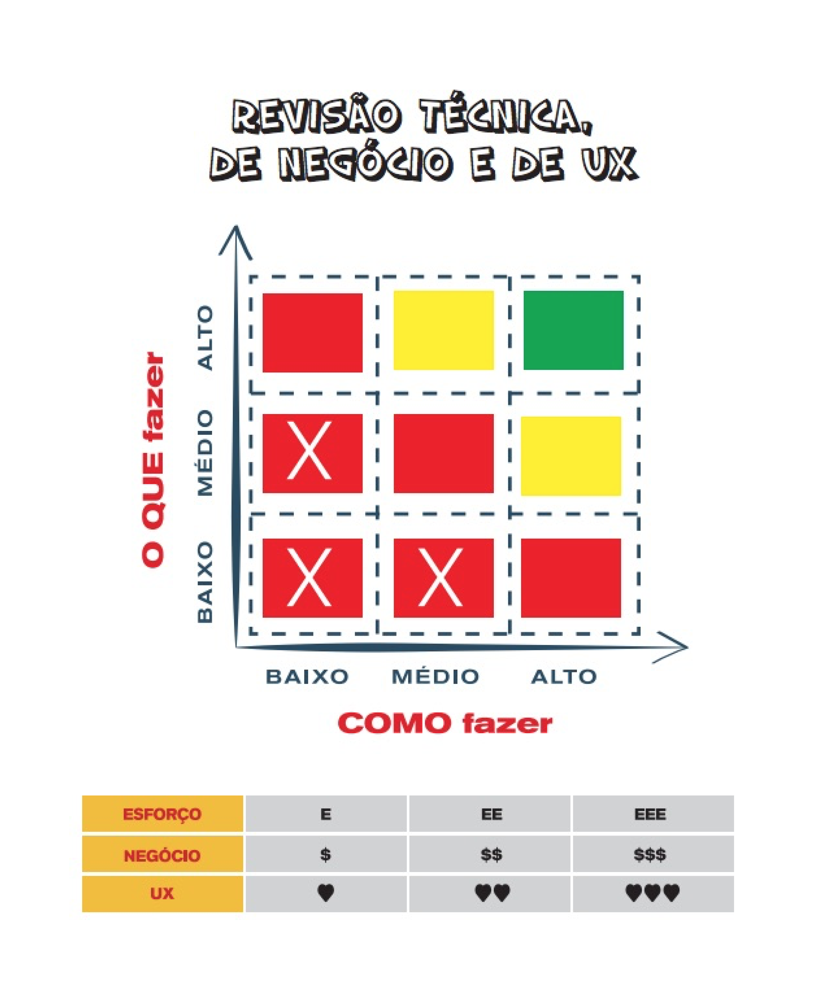

# Lean Inception - Dia 3

## Histórico de versões

| Versão | Data       | Descrição | Autores |
| ------ | ---------- | --------- | ------- |
| 1.0    | 13/04/2024 | Abertura do documento | [Gustavo Abrantes ](https://github.com/GustaaSZ) |
| 1.1    | 19/04/2024 | Imagem Brainstorm e Revisão Técnica | [Gustavo Abrantes ](https://github.com/GustaaSZ) e [Yuri Ezequie ](https://github.com/Yuri57Ezequiel)|

## Sobre

O terceiro dia de uma Lean Inception é uma etapa crítica do processo, pois envolve atividades fundamentais para o desenvolvimento do produto. Neste dia (10/04/2024), a equipe responsável pelo desenvolvimento (EPS/MDS) juntamente com os clientes do projeto (Enactus), se concentram em uma tarefa fundamental: o Brainstorm de Funcionalidade.

No final dele, a equipe deve ter uma lista refinada de funcionalidades priorizadas e bem fundamentadas para o produto. Isso ajuda a garantir que o desenvolvimento se concentre nas áreas mais importantes e que todos na equipe tenham uma compreensão compartilhada das metas do projeto.

Como em reuniões anteriores, as equipes haviam tido um diálogo inicial sobre o possível rumo do produto final (se ele continuaria sendo um produto web, ou se passaria a ser um app nativo), no dia 10/04/2024, não foi possível concluir totalmente o Brainstorm de Funcionalidades, apenas de forma parcial. Desta forma, a equipe de EPS/MDS ficou responsável pelo término da clusterização até dia 11/04 ao 12h e a equipe da Enactus responsável pela validação desta clusterização até o prazo máximo do dia 15/04 ao 12h de forma assíncrona.

## *Brainstorm* de Funcionalidades
Um brainstorm de funcionalidades é uma atividade em grupo onde as equipes geram ideias e conceitos para as funcionalidades ou recursos em um produto ou projeto, de maneira colaborativa e sem críticas iniciais. objetivo é criar um conjunto inicial de ideias que possam ser posteriormente avaliadas e priorizadas.

### *Brainstorm* do GEROcuidado

## Revisão técnica, de negócio e UX
Para estabelecer prioridades em relação às funcionalidades, utilizamos diversas ferramentas, sendo uma delas o "Gráfico de Semáforo". Essa representação visual utiliza cores para indicar o nível de confiança da equipe de desenvolvimento na compreensão e capacidade de implementação de cada funcionalidade. O gráfico utiliza três níveis de confiança:

* **Alto (Verde):** Isso significa que a funcionalidade é compreensível e a equipe sabe como implementá-la.

* **Médio (Amarelo):** Indica que há alguma incerteza na compreensão ou na capacidade de implementação da funcionalidade. Pode ser que a equipe compreenda, mas não saiba como executar, ou vice-versa.

* **Baixo (Vermelho):** Esse nível de confiança sugere que a funcionalidade não foi bem compreendida pela equipe e não sabem como implementá-la.

A imagem anexada ilustra a atribuição das cores, mas o ponto crucial é entender que as cores verdes representam um alto nível de confiança, enquanto o vermelho indica um nível de confiança mais baixo.

Além disso, outra ferramenta importante relacionada à priorização de funcionalidades envolve três símbolos:

* **E (Esforço):** Este símbolo demonstra o esforço que a equipe de desenvolvimento precisará dedicar para implementar a funcionalidade.

* **$ (Valor):** Representa o valor que a funcionalidade agrega ao cliente, Product Owner (PO) ou stakeholders, neste caso, o Enactus. É importante notar que todas as funcionalidades têm importância, mas é crucial estabelecer prioridades com base no valor que cada uma delas oferece.

* **<3 (UX - Experiência do Usuário):** Esse símbolo está relacionado ao conceito de User Experience (Experiência do Usuário) e indica o quanto a funcionalidade é interessante para o usuário.

Ao combinar o Gráfico de Semáforo com esses símbolos, a equipe pode ter uma visão mais clara e completa das funcionalidades do projeto, ajudando na tomada de decisões informadas sobre o que implementar primeiro, considerando tanto a compreensão técnica quanto o valor para o usuário e para o negócio.

### Revisão técnica, de negócios e UX do GEROcuidado
To-Do(Imagem)