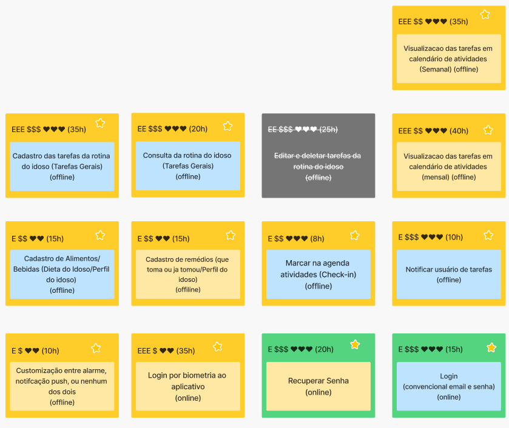
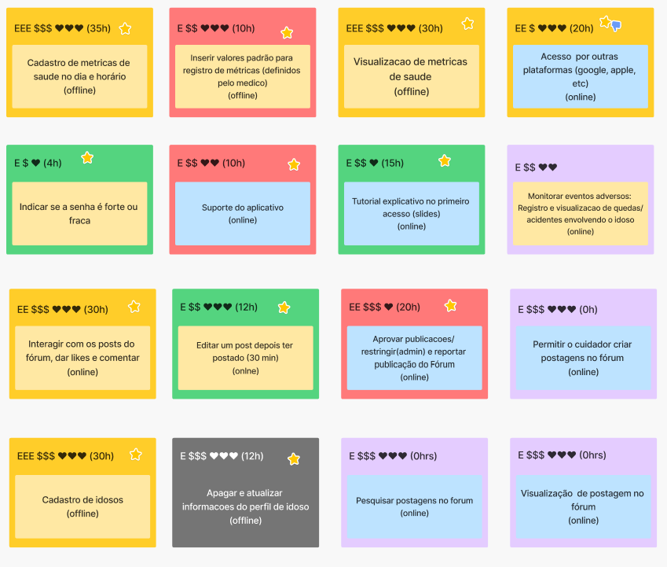
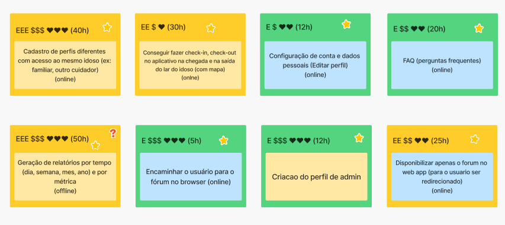
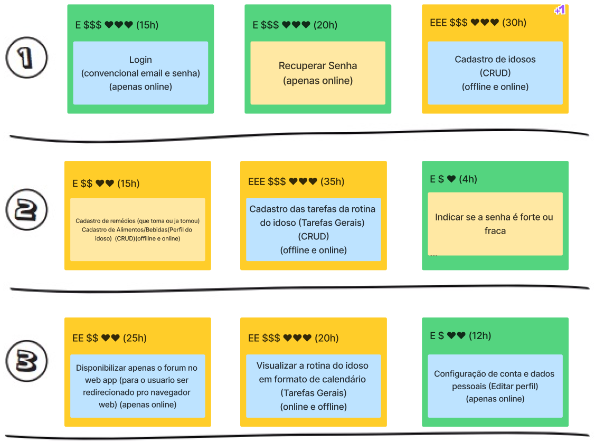
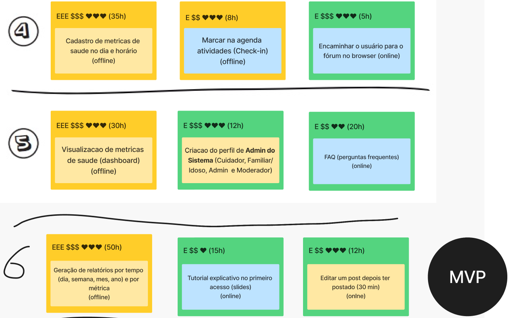
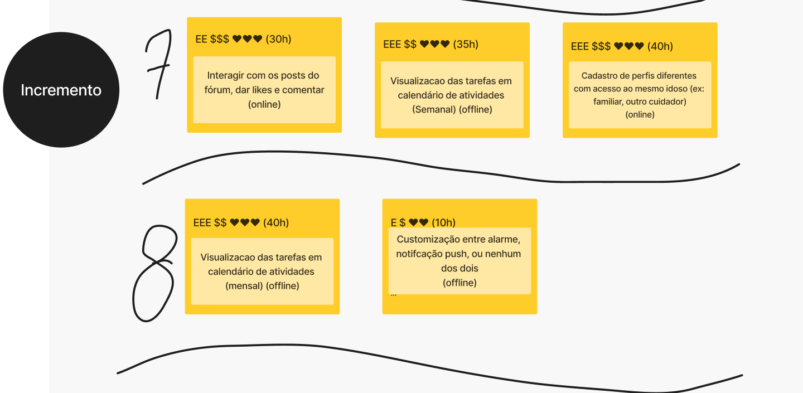
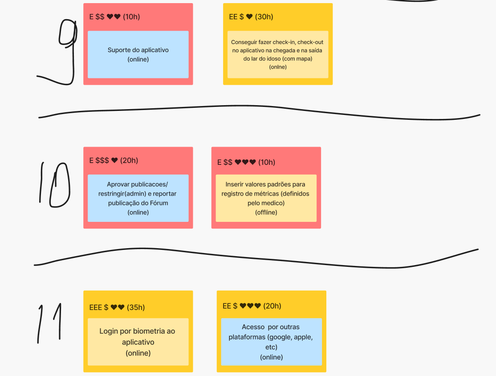
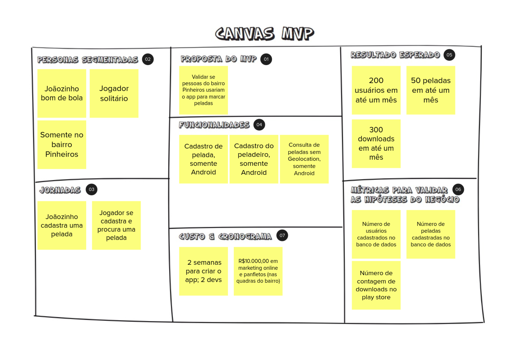
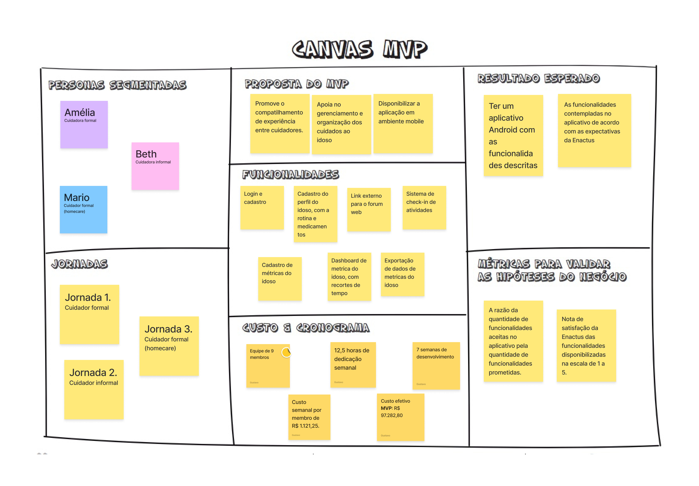

# Lean Inception - Dia 4

## Histórico de versões

| Versão | Data       | Descrição | Autores |
| ------ | ---------- | --------- | ------- |
| 1.0    | 19/04/2024 | Abertura do documento | [Gustavo Abrantes ](https://github.com/GustaaSZ) e [Yuri Ezequie ](https://github.com/Yuri57Ezequiel)|
| 1.1    | 28/04/2024 | Texto do sequenciador | [Sebastian Zuzunaga](https://github.com/sebazac332)|
| 1.3    | 20/07/2024 | Adição do Canvas MVP | [Gustavo Abrantes ](https://github.com/GustaaSZ)|

## Sobre

O quarto dia de uma Lean Inception é um marco importante no processo de desenvolvimento de um novo projeto ou produto. Neste estágio, as ideias e conceitos começam a se materializar de forma mais concreta. Serão 4 elementos-chave desse dia: Revisão Técnica, de Negócios e UX, Sequenciador e o canvas MVP. Esses elementos desempenham um papel fundamental na definição do escopo e na estruturação do projeto. No (19/04/2024), a equipe responsável pelo desenvolvimento (EPS/MDS) juntamente com os clientes do projeto (Enactus), se concentram em uma tarefa fundamental: A Revisão Técnica, de Negócios e UX, que ficou de ser completada de forma assíncrona com a equipe da Enactus até às 9h do dia 20/04. Uma vez concluídas todas estas tarefas, será realizado o Canvas MVP, que cumpre a função de definir quais funções devem ser desenvolvidas no menor tempo possível e quais podem ser relegadas a ser desenvolvidas no futuro.
<!-- e o Canvas MVP -->

## Revisão técnica, de negócio e UX
Para estabelecer prioridades em relação às funcionalidades, utilizamos diversas ferramentas, sendo uma delas o "Gráfico de Semáforo". Essa representação visual utiliza cores para indicar o nível de confiança da equipe de desenvolvimento na compreensão e capacidade de implementação de cada funcionalidade. O gráfico utiliza três níveis de confiança:

* **Alto (Verde):** Isso significa que a funcionalidade é compreensível e a equipe sabe como implementá-la.

* **Médio (Amarelo):** Indica que há alguma incerteza na compreensão ou na capacidade de implementação da funcionalidade. Pode ser que a equipe compreenda, mas não saiba como executar, ou vice-versa.

* **Baixo (Vermelho):** Esse nível de confiança sugere que a funcionalidade não foi bem compreendida pela equipe e não sabem como implementá-la.

A imagem anexada ilustra a atribuição das cores, mas o ponto crucial é entender que as cores verdes representam um alto nível de confiança, enquanto o vermelho indica um nível de confiança mais baixo.

Além disso, outra ferramenta importante relacionada à priorização de funcionalidades envolve três símbolos:

* **E (Esforço):** Este símbolo demonstra o esforço que a equipe de desenvolvimento precisará dedicar para implementar a funcionalidade.

* **$ (Valor):** Representa o valor que a funcionalidade agrega ao cliente, Product Owner (PO) ou stakeholders, neste caso, o Enactus. É importante notar que todas as funcionalidades têm importância, mas é crucial estabelecer prioridades com base no valor que cada uma delas oferece.

* **<3 (UX - Experiência do Usuário):** Esse símbolo está relacionado ao conceito de User Experience (Experiência do Usuário) e indica o quanto a funcionalidade é interessante para o usuário.

Ao combinar o Gráfico de Semáforo com esses símbolos, a equipe pode ter uma visão mais clara e completa das funcionalidades do projeto, ajudando na tomada de decisões informadas sobre o que implementar primeiro, considerando tanto a compreensão técnica quanto o valor para o usuário e para o negócio.

### Revisão técnica, de negócios e UX do GEROcuidado

## Sequenciador
O sequenciador nos ajudará a determinar quais funcionalidades devem ser priorizadas para o produto. Tomam-se as funções previamente definidas para a aplicação e organizam-se numa sequência lógica, onde se identificam quais devem ser implementadas no menor tempo possível (Produto Mínimo Viável) e quais podem ser relegadas a ser implementadas no futuro, esta lista orientará o desenvolvimento do projecto.

A lista previamente mencionada será dividida em ondas, estas vão definir a ordem em que se realizarão as tarefas, para sua criação existem algumas regras que garantem a suficiente criação de valor e limitam a dificuldade de cada onda. 

* **Regra 1:** Uma onda pode conter no máximo três, cartões.

* **Regra 2:** Uma onda não pode conter mais de uma cartão vermelho.

* **Regra 3:** Uma onda não pode conter três cartões somente amarelos ou vermelho.

* **Regra 4:** A soma de esforço dos cartões não pode ultrapassar cinco Es.

* **Regra 5:** A soma de valor dos cartões não pode ser menos de quatro $s e quatro corações.

* **Regra 6:** Se um cartão depende de outro, esse outro deve estar em alguma onda anterior.

## Sequenciador do GEROcuidado

## Canvas MVP

O Canvas MVP é uma ferramenta visual que ajuda a equipe a definir o que fará parte do Produto Mínimo Viável. Ele geralmente é composto por nove áreas ou blocos, incluindo:

- **Objetivo do MVP:** Uma declaração clara do que se pretende alcançar com o MVP.

- **Problema:** Uma descrição do problema que o MVP está resolvendo para os usuários.

- **Solução:** Uma visão geral da solução que será implementada.

- **Usuários:** Quem são os usuários-alvo do MVP.

- **Características Principais:** As funcionalidades centrais que serão incluídas no MVP.

- **Métricas de Sucesso:** Como o sucesso do MVP será medido.

- **Hipóteses:** Suposições ou previsões que estão sendo testadas com o MVP.

- **Restrições:** Quaisquer limitações ou restrições que afetam o desenvolvimento do MVP.

- **Aprendizados:** Espaço para registrar o que a equipe aprendeu durante o processo de criação do Canvas MVP.

O Canvas MVP ajuda a equipe a visualizar de forma clara e concisa o escopo do Produto Mínimo Viável, garantindo que todos tenham uma compreensão comum do que será desenvolvido e por quê.

### Canvas MVP do GEROcuidado

