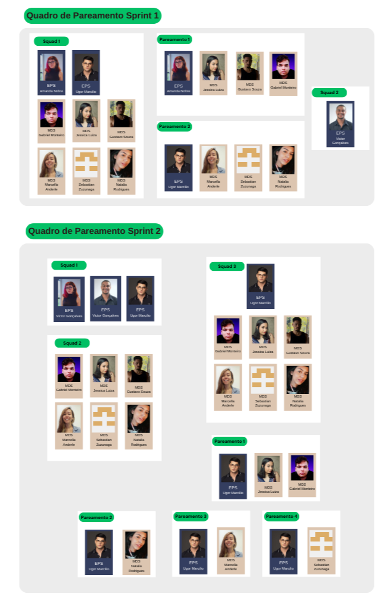

# Quadro de pareamento

## Histórico de versões

| Versão | Data       | Descrição | Autores |
| ------ | ---------- | --------- | ------- |
| 1.0    | 26/07/2024 | Abertura do documento | Jessica Luiza Silva de Oliveira |
| 2.0    | 08/09/2024 | Atualização do Documento | Gabriel Santos Monteiro |

## Introdução
O quadro de pareamento é uma técnica de colaboração no desenvolvimento de software que envolve dois ou mais desenvolvedores trabalhando juntos. Seguindo os padrões da matéria e pela escolha do time, foi realizado a escolha dos pareamentos da seguinte forma: 

### Sprint 1:
<ul>
  <li>1 EPS e 3 MDS;</li>
  <li>1 EPS e 3 MDS;</li>
    <li>1 EPS;</li>
</ul>

### Sprint 2 à 8:
<ul>
  <li>3 EPS;</li>
  <li>6 MDS;</li>
      <li>1 EPS e 6 MDS;</li>
</ul>

## Quadro de Pareamento

