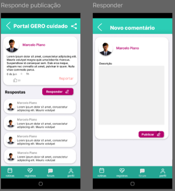

# Protótipo

## Introdução

Na área de desenvolvimento de software, a criação de protótipos desempenha um papel fundamental na concepção e no aprimoramento de sistemas e aplicações. Um protótipo é uma representação inicial de um software que permite aos desenvolvedores, designers e partes interessadas visualizarem e interagirem com as funcionalidades e a aparência do sistema antes da implementação final. Os protótipos são uma ferramenta valiosa para validar conceitos, coletar feedback, identificar requisitos e economizar tempo e recursos no ciclo de desenvolvimento.

No entanto, os protótipos podem ser classificados em duas categorias distintas: protótipos de baixa fidelidade e protótipos de alta fidelidade. A diferença entre esses dois tipos de protótipos reside na profundidade do detalhe e na precisão com que representam o sistema final. Protótipos de baixa fidelidade geralmente são simplificados e rápidos de criar, enquanto protótipos de alta fidelidade se assemelham mais de perto ao produto final em termos de funcionalidade e aparência.

## Protótipos do GEROcuidado

A prototipação que ocorreu no projeto GEROcuidado, foi um pocuo diferente, de certa forma um caso atípico, o que ocorreu foi que o cliente, no caso os membros do Enactus, já tinham um protótipo de alta fidelidade desenvolvido, dessa forma muitas das funcionalidades abordadas por eles durante a criação da visão do produto já estavam evidenciados no protótipo. Entrentanto, apesar do protótipo trazer essas diferças funcionalidades, ele ainda precisava ser complementado, visto que o mesmo não abordava todas as telas necessárias para ser ter cada um dos fluxos propostos, dessa forma o time de desenvolvimento, realizou mudanças para que o protótipo atendesse ao fluxo funcional das funcionalidades. tendo então o resultado abaixo:

## Protótipo Funcional

Ao serem criados as telas foi pensado no esquema de prototipar para utilização, logo foi gerado o seguinte resultado

<iframe style="border: 1px solid rgba(0, 0, 0, 0.1);" width="800" height="900" src="https://www.figma.com/embed?embed_host=share&url=https%3A%2F%2Fwww.figma.com%2Fproto%2F9iDnO4tYhw7REON2ReqziP%2FGEROcuidado-(Copy)%3Ftype%3Ddesign%26node-id%3D497-3896%26t%3DjvVfjo4SdIZIbSrh-1%26scaling%3Dmin-zoom%26page-id%3D497%253A3344%26starting-point-node-id%3D497%253A3896%26mode%3Ddesign" allowfullscreen></iframe>

## Telas de Protótipo

### Tutorial

### Tela Inicial

### Login

### Cadastrar Perfil de Usuário

### Perfil de Usuário

### Cadastrar Idoso

### Fórum

### Editar Publicação

### Moderação

### Cadastrar Rotina

### Notificações

### Visualizar Rotina

### Métricas de sáude

### Sem Conexão
